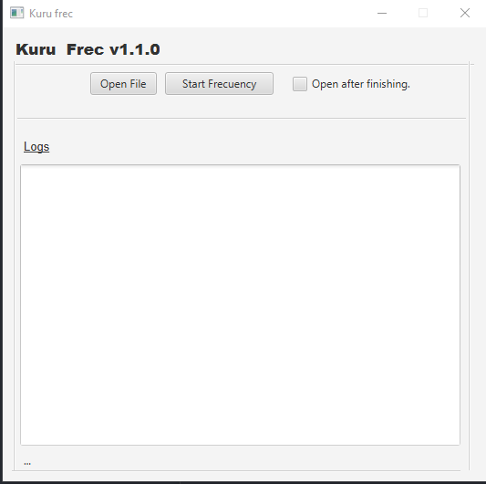
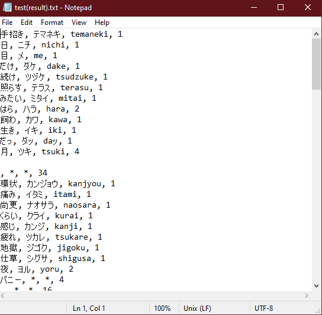

# Kuru Frec

Kuru Frec is a lightweight tool designed for generating Japanese word frequencies. 📚✨

## Images

## How to Use

- Download the zip file from the [Releases](https://github.com/your-username/your-repo/releases) section.
- Run the `kurufre.cmd` script. Ensure that you have Java 17 or a later version installed and configured in your system's path.

## Contributions

- If you wish to enhance the existing code or suggest new features, your contributions are more than welcome.
- Encountering issues? Open an [issue](https://github.com/your-username/your-repo/issues), and I'll do my best to assist.
- When contributing, please provide detailed and precise pull requests.

## Important Notes

- This project is a personal endeavor and is open source under the MIT license.

## Acknowledgments

This project was made possible by the incredible open source library: [KuroMoji](https://github.com/atilika/kuromoji). 🙌📦

Feel free to explore, contribute, and enjoy Kuru Frec! If you have any questions or suggestions, don't hesitate to reach out. 😊